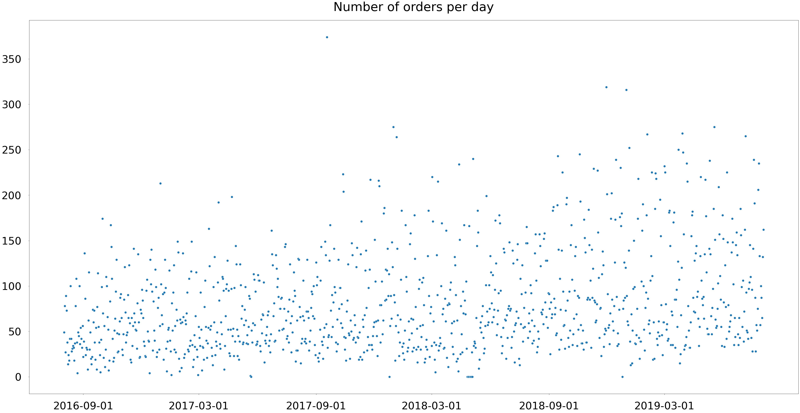

# XGBRegressor prediction
## XGBRegressor for probabilistic prediction.

```
import matplotlib.pyplot as plt
import seaborn as sns
import pandas as pd
from pyspark.sql.functions import sum, col, min, max, to_timestamp, to_date, date_format, round
from xgboost import XGBRegressor
from sklearn.metrics import mean_absolute_error, mean_squared_log_error, r2_score, explained_variance_score
```


    


```
# Install regression algorithm
#%pip install xgboost
```


```
# Load data into dataframes
dfR1_o = sqlContext.read.load('/FileStore/tables/restaurant_1_orders.csv', format='csv', header=True, inferSchema=True)
```

## Data exploration


```
# First glance over data using display() function
dfR1_o.show()
```

    +------------+----------------+--------------------+--------+-------------+--------------+
    |Order Number|      Order Date|           Item Name|Quantity|Product Price|Total products|
    +------------+----------------+--------------------+--------+-------------+--------------+
    |       16118|03/08/2019 20:25|       Plain Papadum|       2|          0.8|             6|
    |       16118|03/08/2019 20:25|    King Prawn Balti|       1|        12.95|             6|
    |       16118|03/08/2019 20:25|         Garlic Naan|       1|         2.95|             6|
    |       16118|03/08/2019 20:25|       Mushroom Rice|       1|         3.95|             6|
    |       16118|03/08/2019 20:25| Paneer Tikka Masala|       1|         8.95|             6|
    |       16118|03/08/2019 20:25|       Mango Chutney|       1|          0.5|             6|
    |       16117|03/08/2019 20:17|          Plain Naan|       1|          2.6|             7|
    |       16117|03/08/2019 20:17|       Mushroom Rice|       1|         3.95|             7|
    |       16117|03/08/2019 20:17|Tandoori Chicken ...|       1|         4.95|             7|
    |       16117|03/08/2019 20:17|     Vindaloo - Lamb|       1|         7.95|             7|
    |       16117|03/08/2019 20:17|             Chapati|       1|         1.95|             7|
    |       16117|03/08/2019 20:17|          Lamb Tikka|       1|         4.95|             7|
    |       16117|03/08/2019 20:17|         Saag Paneer|       1|         5.95|             7|
    |       16116|03/08/2019 20:09|          Aloo Chaat|       1|         4.95|             5|
    |       16116|03/08/2019 20:09|      Chicken Pakora|       1|         5.95|             5|
    |       16116|03/08/2019 20:09|Chicken Chilli Ga...|       1|         9.95|             5|
    |       16116|03/08/2019 20:09|        Lamb Biryani|       1|         9.95|             5|
    |       16116|03/08/2019 20:09|          Keema Naan|       1|         2.95|             5|
    |       16115|03/08/2019 20:01|      Chicken Pakora|       1|         5.95|             7|
    |       16115|03/08/2019 20:01|       Plain Papadum|       1|          0.8|             7|
    +------------+----------------+--------------------+--------+-------------+--------------+
    only showing top 20 rows
    


```
# Grouping by Item Name
display(dfR1_o.groupBy("Item Name").sum().orderBy("sum(Total Products)",ascending=0))
```


<style scoped>
  .table-result-container {
    max-height: 300px;
    overflow: auto;
  }
  table, th, td {
    border: 1px solid black;
    border-collapse: collapse;
  }
  th, td {
    padding: 5px;
  }
  th {
    text-align: left;
  }
</style><div class='table-result-container'><table class='table-result'><thead style='background-color: white'><tr><th>Item Name</th><th>sum(Order Number)</th><th>sum(Quantity)</th><th>sum(Product Price)</th><th>sum(Total products)</th></tr></thead><tbody><tr><td>Pilau Rice</td><td>43450300</td><td>6367</td><td>13926.95000000106</td><td>31314</td></tr><tr><td>Plain Papadum</td><td>33504914</td><td>10648</td><td>2878.4000000001065</td><td>27140</td></tr><tr><td>Plain Naan</td><td>33978950</td><td>4983</td><td>9757.80000000069</td><td>24276</td></tr><tr><td>Onion Bhajee</td><td>21818221</td><td>2749</td><td>9487.899999999972</td><td>17293</td></tr><tr><td>Garlic Naan</td><td>23930176</td><td>3318</td><td>7752.599999999671</td><td>17143</td></tr><tr><td>Mango Chutney</td><td>19194045</td><td>2504</td><td>1035.0</td><td>16991</td></tr><tr><td>Plain Rice</td><td>21315452</td><td>2964</td><td>6988.549999999718</td><td>15345</td></tr><tr><td>Chicken Tikka Masala</td><td>19303060</td><td>2473</td><td>19090.350000000766</td><td>14439</td></tr><tr><td>Mint Sauce</td><td>13604320</td><td>1840</td><td>731.5</td><td>12615</td></tr><tr><td>Bombay Aloo</td><td>16083952</td><td>1831</td><td>10424.400000000096</td><td>12373</td></tr><tr><td>Peshwari Naan</td><td>14158689</td><td>1734</td><td>4528.24999999987</td><td>10898</td></tr><tr><td>Mushroom Rice</td><td>13326354</td><td>1615</td><td>5735.399999999847</td><td>10286</td></tr><tr><td>Keema Naan</td><td>12192201</td><td>1520</td><td>4017.899999999901</td><td>9754</td></tr><tr><td>Onion Chutney</td><td>9310794</td><td>1291</td><td>516.5</td><td>9072</td></tr><tr><td>Saag Aloo</td><td>10811297</td><td>1234</td><td>7104.2999999998565</td><td>8958</td></tr><tr><td>Chapati</td><td>10534881</td><td>1935</td><td>2281.500000000012</td><td>7933</td></tr><tr><td>Korma</td><td>6862430</td><td>1370</td><td>10854.95000000009</td><td>7838</td></tr><tr><td>Meat Samosa</td><td>10713819</td><td>1411</td><td>4708.399999999894</td><td>7739</td></tr><tr><td>Butter Chicken</td><td>9273221</td><td>1068</td><td>9751.00000000001</td><td>6427</td></tr><tr><td>Red Sauce</td><td>6081461</td><td>728</td><td>333.0</td><td>6168</td></tr><tr><td>Korma - Chicken</td><td>12050839</td><td>1091</td><td>8439.849999999902</td><td>6167</td></tr><tr><td>Madras</td><td>4790890</td><td>851</td><td>6506.749999999909</td><td>5477</td></tr><tr><td>Chicken Tikka (Main)</td><td>7326042</td><td>905</td><td>7204.749999999903</td><td>5442</td></tr><tr><td>Chicken Tikka</td><td>6371270</td><td>728</td><td>3432.349999999962</td><td>4563</td></tr><tr><td>Tandoori Mixed Grill</td><td>5967235</td><td>716</td><td>7958.699999999916</td><td>4275</td></tr><tr><td>Special Fried Rice</td><td>5848598</td><td>713</td><td>2551.6999999999935</td><td>4211</td></tr><tr><td>Aloo Gobi</td><td>5641994</td><td>620</td><td>3659.249999999962</td><td>4187</td></tr><tr><td>Sheek Kebab</td><td>4827884</td><td>589</td><td>2682.8999999999896</td><td>3762</td></tr><tr><td>Mixed Starter</td><td>4790871</td><td>586</td><td>3218.9499999999753</td><td>3730</td></tr><tr><td>Spicy Papadum</td><td>4158488</td><td>784</td><td>366.40000000000305</td><td>3640</td></tr><tr><td>French Fries</td><td>4929234</td><td>560</td><td>2073.7500000000155</td><td>3638</td></tr><tr><td>Chicken Biryani</td><td>5723874</td><td>771</td><td>6477.449999999926</td><td>3548</td></tr><tr><td>Lime Pickle</td><td>3264912</td><td>386</td><td>183.0</td><td>3544</td></tr><tr><td>Saag Paneer</td><td>4587769</td><td>537</td><td>3010.6999999999816</td><td>3494</td></tr><tr><td>Curry</td><td>3121331</td><td>639</td><td>4367.999999999957</td><td>3449</td></tr><tr><td>Tarka Dall</td><td>4712374</td><td>567</td><td>3117.7999999999784</td><td>3413</td></tr><tr><td>Chicken Tikka Jalfrezi</td><td>4446813</td><td>481</td><td>4170.699999999964</td><td>3228</td></tr><tr><td>Bhuna</td><td>2909536</td><td>524</td><td>4507.59999999996</td><td>3164</td></tr><tr><td>Madras - Chicken</td><td>6157790</td><td>508</td><td>3855.749999999967</td><td>2966</td></tr><tr><td>Tandoori Roti</td><td>4243825</td><td>593</td><td>1183.0000000000007</td><td>2818</td></tr><tr><td>Keema Rice</td><td>3286403</td><td>401</td><td>1445.7000000000096</td><td>2705</td></tr><tr><td>Mushroom Bhajee</td><td>2894206</td><td>335</td><td>1969.4500000000103</td><td>2670</td></tr><tr><td>Chicken Tikka Biryani</td><td>4218265</td><td>500</td><td>5080.799999999956</td><td>2601</td></tr><tr><td>Chicken Shashlick</td><td>3230696</td><td>375</td><td>3522.2999999999797</td><td>2553</td></tr><tr><td>Dhansak</td><td>2093986</td><td>387</td><td>3482.09999999998</td><td>2548</td></tr><tr><td>Paratha</td><td>3430845</td><td>474</td><td>1100.3500000000076</td><td>2544</td></tr><tr><td>Prawn Puree</td><td>3428285</td><td>416</td><td>1856.2500000000114</td><td>2528</td></tr><tr><td>Lamb Biryani</td><td>4647535</td><td>602</td><td>5124.249999999951</td><td>2466</td></tr><tr><td>Chana Masala</td><td>3412597</td><td>400</td><td>2255.0500000000047</td><td>2443</td></tr><tr><td>Curry - Chicken</td><td>4592200</td><td>457</td><td>2861.9999999999895</td><td>2404</td></tr><tr><td>Chicken Chaat</td><td>2980553</td><td>384</td><td>1668.1500000000096</td><td>2396</td></tr><tr><td>Chicken Pakora</td><td>2771609</td><td>318</td><td>1832.6000000000092</td><td>2353</td></tr><tr><td>Royal Paneer</td><td>3382559</td><td>380</td><td>2100.3500000000095</td><td>2276</td></tr><tr><td>Vegetable Rice</td><td>3695025</td><td>459</td><td>1528.6500000000106</td><td>2272</td></tr><tr><td>Chicken Balti</td><td>3695133</td><td>387</td><td>3721.299999999976</td><td>2173</td></tr><tr><td>Raitha</td><td>2418755</td><td>306</td><td>799.450000000003</td><td>2034</td></tr><tr><td>Vegetable Roll</td><td>2490432</td><td>311</td><td>1415.7000000000073</td><td>2005</td></tr><tr><td>Egg Rice</td><td>2773169</td><td>333</td><td>1212.650000000007</td><td>1990</td></tr><tr><td>Chicken Tikka Chilli Masala</td><td>2530522</td><td>337</td><td>2684.999999999994</td><td>1968</td></tr><tr><td>Tandoori Chicken (Main)</td><td>3024905</td><td>404</td><td>3105.6499999999855</td><td>1964</td></tr><tr><td>Onion Rice</td><td>2157636</td><td>258</td><td>951.950000000004</td><td>1882</td></tr><tr><td>Vegetable Biryani</td><td>3247368</td><td>365</td><td>3183.999999999986</td><td>1813</td></tr><tr><td>Aloo Chaat</td><td>2599628</td><td>316</td><td>1410.7500000000073</td><td>1808</td></tr><tr><td>Mixed Vegetable Curry</td><td>2490712</td><td>264</td><td>1552.950000000007</td><td>1724</td></tr><tr><td>Masala Sauce</td><td>1935599</td><td>214</td><td>829.5000000000026</td><td>1709</td></tr><tr><td>Vindaloo</td><td>1411589</td><td>284</td><td>2070.300000000008</td><td>1672</td></tr><tr><td>Chicken Tikka Balti</td><td>2507004</td><td>288</td><td>3055.0499999999893</td><td>1667</td></tr><tr><td>Saag Rice</td><td>2095257</td><td>239</td><td>904.5500000000035</td><td>1631</td></tr><tr><td>Garlic Rice</td><td>1901290</td><td>234</td><td>861.100000000003</td><td>1620</td></tr><tr><td>Lamb Tikka</td><td>2321668</td><td>247</td><td>1188.0000000000052</td><td>1598</td></tr><tr><td>Lemon Rice</td><td>1953337</td><td>224</td><td>801.8500000000023</td><td>1553</td></tr><tr><td>Bhindi Bhajee</td><td>2343338</td><td>247</td><td>1398.250000000006</td><td>1553</td></tr><tr><td>Chicken Tikka Pasanda</td><td>2018501</td><td>223</td><td>1951.1000000000067</td><td>1534</td></tr><tr><td>Saag Bhajee</td><td>2023389</td><td>232</td><td>1380.4000000000058</td><td>1531</td></tr><tr><td>Chicken Tikka Garlic</td><td>1516112</td><td>205</td><td>1798.950000000006</td><td>1530</td></tr><tr><td>Korma Sauce</td><td>1909013</td><td>223</td><td>853.2000000000029</td><td>1524</td></tr><tr><td>Tandoori Chicken Masala</td><td>1829437</td><td>212</td><td>1852.6500000000062</td><td>1479</td></tr><tr><td>Bhuna - Chicken</td><td>2534948</td><td>211</td><td>1772.1000000000058</td><td>1385</td></tr><tr><td>Dupiaza</td><td>1066103</td><td>191</td><td>1677.7000000000053</td><td>1381</td></tr><tr><td>Paneer Tikka Masala</td><td>2229521</td><td>258</td><td>2067.4500000000066</td><td>1377</td></tr><tr><td>Onion Naan</td><td>1821424</td><td>215</td><td>578.1999999999996</td><td>1369</td></tr><tr><td>Saag</td><td>1354201</td><td>230</td><td>2066.750000000007</td><td>1341</td></tr><tr><td>Cauliflower Bhajee</td><td>1981831</td><td>215</td><td>1261.4000000000049</td><td>1339</td></tr><tr><td>Dhansak - Chicken</td><td>2511926</td><td>195</td><td>1718.4000000000055</td><td>1337</td></tr><tr><td>Tandoori Chicken (1/4)</td><td>1643420</td><td>221</td><td>1029.6000000000038</td><td>1316</td></tr><tr><td>Dupiaza - Chicken</td><td>2518299</td><td>235</td><td>1790.000000000006</td><td>1295</td></tr><tr><td>Chicken Karahi</td><td>1881097</td><td>225</td><td>1888.4500000000064</td><td>1290</td></tr><tr><td>Baingan Hari Mirch</td><td>2034794</td><td>199</td><td>1172.1500000000042</td><td>1272</td></tr><tr><td>Rogon</td><td>1052504</td><td>185</td><td>1578.3000000000047</td><td>1239</td></tr><tr><td>Lamb Tikka Masala</td><td>1581444</td><td>185</td><td>1611.000000000005</td><td>1173</td></tr><tr><td>Puree</td><td>1440936</td><td>236</td><td>335.39999999999895</td><td>1173</td></tr><tr><td>Pathia</td><td>964435</td><td>178</td><td>1612.3000000000047</td><td>1154</td></tr><tr><td>Chicken Chilli Garlic</td><td>2007868</td><td>179</td><td>1711.400000000005</td><td>1150</td></tr><tr><td>Coke 1.5 ltr</td><td>899453</td><td>174</td><td>498.54999999999865</td><td>1149</td></tr><tr><td>King Prawn Puree</td><td>1739590</td><td>196</td><td>1071.0000000000034</td><td>1140</td></tr><tr><td>Green Salad</td><td>1358515</td><td>174</td><td>442.49999999999886</td><td>1140</td></tr><tr><td>Muttar Paneer</td><td>1497718</td><td>179</td><td>1059.1000000000033</td><td>1140</td></tr><tr><td>Tandoori Fish</td><td>1454029</td><td>177</td><td>1023.4000000000032</td><td>1095</td></tr><tr><td>Stuffed Paratha</td><td>1314659</td><td>184</td><td>568.7999999999996</td><td>1086</td></tr><tr><td>Lamb Balti</td><td>1746336</td><td>188</td><td>1820.8500000000056</td><td>1076</td></tr><tr><td>Brinjal Bhajee</td><td>1181154</td><td>134</td><td>797.3000000000014</td><td>1064</td></tr><tr><td>Kulcha Naan</td><td>1294720</td><td>183</td><td>448.39999999999884</td><td>1060</td></tr><tr><td>Curry - Lamb</td><td>1962123</td><td>164</td><td>1248.1500000000037</td><td>1037</td></tr><tr><td>Madras - Lamb</td><td>1970971</td><td>161</td><td>1240.2000000000037</td><td>1034</td></tr><tr><td>Sheek Kebab (Main)</td><td>1024664</td><td>153</td><td>1217.200000000003</td><td>1013</td></tr><tr><td>Lamb Tikka Jalfrezi</td><td>1254198</td><td>134</td><td>1190.3500000000029</td><td>1004</td></tr><tr><td>Chicken Shashlick Curry</td><td>1165377</td><td>141</td><td>1774.150000000004</td><td>995</td></tr><tr><td>Bottle Coke</td><td>1886252</td><td>153</td><td>442.49999999999886</td><td>956</td></tr><tr><td>King Prawn Shaslick</td><td>1424082</td><td>214</td><td>2123.800000000004</td><td>931</td></tr><tr><td>COBRA (660ML)</td><td>891931</td><td>184</td><td>791.3500000000014</td><td>926</td></tr><tr><td>Lamb Tikka (Main)</td><td>1403146</td><td>152</td><td>1342.5000000000036</td><td>923</td></tr><tr><td>Madras Sauce</td><td>1304789</td><td>135</td><td>525.3499999999991</td><td>914</td></tr><tr><td>Chicken Hari Mirch</td><td>1105841</td><td>129</td><td>1283.5500000000031</td><td>913</td></tr><tr><td>Bhuna - Chicken Tikka</td><td>1611709</td><td>141</td><td>1145.6000000000026</td><td>911</td></tr><tr><td>Lamb Karahi</td><td>1258739</td><td>153</td><td>1342.5000000000036</td><td>904</td></tr><tr><td>Bhuna - Lamb</td><td>1544115</td><td>122</td><td>1091.9000000000024</td><td>899</td></tr><tr><td>Chicken Tikka Sizzler</td><td>1140689</td><td>138</td><td>1263.650000000003</td><td>893</td></tr><tr><td>Vindaloo - Chicken</td><td>1812203</td><td>161</td><td>1089.1500000000028</td><td>851</td></tr><tr><td>Dhansak Sauce</td><td>826989</td><td>87</td><td>335.7499999999995</td><td>851</td></tr><tr><td>Tandoori King Prawn Garlic</td><td>1288039</td><td>124</td><td>1566.9500000000032</td><td>850</td></tr><tr><td>Paneer Shaslick</td><td>1068343</td><td>124</td><td>1184.0500000000027</td><td>837</td></tr><tr><td>King Prawn Butterfly</td><td>882675</td><td>114</td><td>660.4500000000004</td><td>829</td></tr><tr><td>Saag Dall</td><td>1278041</td><td>141</td><td>821.1000000000016</td><td>821</td></tr><tr><td>Lemonade 1.5 ltr</td><td>919538</td><td>107</td><td>297.9499999999994</td><td>775</td></tr><tr><td>Curry Sauce</td><td>950810</td><td>112</td><td>402.8999999999993</td><td>774</td></tr><tr><td>Lamb Tikka Biryani</td><td>1370598</td><td>161</td><td>1609.6500000000042</td><td>746</td></tr><tr><td>Hazary Lamb</td><td>843566</td><td>117</td><td>1450.4000000000028</td><td>732</td></tr><tr><td>Bengal King Prawn</td><td>825802</td><td>109</td><td>1307.9500000000023</td><td>721</td></tr><tr><td>Madras - Chicken Tikka</td><td>1285328</td><td>103</td><td>810.9000000000012</td><td>702</td></tr><tr><td>Chicken Tikka Karahi</td><td>1109402</td><td>117</td><td>1134.3000000000025</td><td>696</td></tr><tr><td>Lamb Tikka Pasanda</td><td>813548</td><td>94</td><td>841.3000000000012</td><td>689</td></tr><tr><td>Diet Coke 1.5 ltr</td><td>538340</td><td>97</td><td>280.2499999999995</td><td>679</td></tr><tr><td>Vindaloo Sauce</td><td>920981</td><td>93</td><td>351.54999999999944</td><td>677</td></tr><tr><td>Chicken Mysore</td><td>829733</td><td>94</td><td>905.4500000000014</td><td>640</td></tr><tr><td>Tandoori King Prawn Masala</td><td>861348</td><td>98</td><td>1230.250000000002</td><td>637</td></tr><tr><td>Paneer Tikka Karahi</td><td>997069</td><td>103</td><td>1024.850000000002</td><td>594</td></tr><tr><td>Chicken Rezala</td><td>751893</td><td>86</td><td>825.850000000001</td><td>590</td></tr><tr><td>Rogon - Lamb</td><td>1104319</td><td>88</td><td>769.7000000000008</td><td>589</td></tr><tr><td>Dall Samba</td><td>655602</td><td>85</td><td>487.89999999999935</td><td>586</td></tr><tr><td>COBRA (330ML)</td><td>686554</td><td>106</td><td>335.7499999999995</td><td>565</td></tr><tr><td>Lal Mirch Chicken</td><td>737367</td><td>93</td><td>815.900000000001</td><td>554</td></tr><tr><td>Saag - Lamb</td><td>922705</td><td>77</td><td>653.3500000000003</td><td>550</td></tr><tr><td>Lamb Tikka Chilli Masala</td><td>702512</td><td>86</td><td>751.8000000000008</td><td>549</td></tr><tr><td>Lamb Shashlick</td><td>586483</td><td>85</td><td>805.950000000001</td><td>535</td></tr><tr><td>Saag - Chicken</td><td>1091123</td><td>90</td><td>769.7000000000008</td><td>525</td></tr><tr><td>King Prawn Hari Mirch</td><td>678140</td><td>73</td><td>932.4000000000011</td><td>525</td></tr><tr><td>Lamb Mysore</td><td>667799</td><td>69</td><td>666.6500000000003</td><td>523</td></tr><tr><td>Bengal Salad</td><td>534160</td><td>73</td><td>272.54999999999967</td><td>521</td></tr><tr><td>House Red wine 75cl</td><td>579280</td><td>132</td><td>1525.7500000000023</td><td>515</td></tr><tr><td>Curry - Chicken Tikka</td><td>900994</td><td>72</td><td>548.5499999999997</td><td>509</td></tr><tr><td>Korma - Lamb</td><td>709960</td><td>58</td><td>510.1499999999996</td><td>506</td></tr><tr><td>Persian Chicken Biryani</td><td>804229</td><td>98</td><td>1018.3500000000017</td><td>500</td></tr><tr><td>Lamb Chilli Garlic</td><td>737623</td><td>67</td><td>666.6500000000003</td><td>478</td></tr><tr><td>Vegetable Mysore</td><td>733328</td><td>80</td><td>475.9999999999994</td><td>474</td></tr><tr><td>Prawn Biryani</td><td>559761</td><td>83</td><td>810.3000000000009</td><td>470</td></tr><tr><td>Paneer Tikka Sizzler</td><td>641270</td><td>67</td><td>666.6500000000003</td><td>467</td></tr><tr><td>Lamb Shashlick Curry</td><td>454067</td><td>64</td><td>815.8500000000007</td><td>466</td></tr><tr><td>Lal Mirch Lamb</td><td>536204</td><td>65</td><td>626.8500000000001</td><td>465</td></tr><tr><td>Pathia - Chicken</td><td>944979</td><td>71</td><td>635.4500000000002</td><td>461</td></tr><tr><td>Dhansak - Chicken Tikka</td><td>868105</td><td>71</td><td>626.5000000000001</td><td>457</td></tr><tr><td>Chicken Haryali</td><td>589460</td><td>72</td><td>686.5500000000004</td><td>449</td></tr><tr><td>Paneer Tikka Balti</td><td>842731</td><td>91</td><td>952.6500000000015</td><td>447</td></tr><tr><td>Dhansak - Lamb</td><td>736437</td><td>63</td><td>519.0999999999996</td><td>443</td></tr><tr><td>Vegetable Balti</td><td>649679</td><td>74</td><td>736.3000000000006</td><td>441</td></tr><tr><td>Vegetable Karahi</td><td>547205</td><td>72</td><td>617.5500000000001</td><td>436</td></tr><tr><td>Lamb Rezala</td><td>558683</td><td>59</td><td>587.05</td><td>436</td></tr><tr><td>Lamb Tikka Balti</td><td>597199</td><td>68</td><td>744.6000000000006</td><td>433</td></tr><tr><td>Lamb Hari Mirch</td><td>585518</td><td>63</td><td>606.95</td><td>429</td></tr><tr><td>Lamb Haryali</td><td>498457</td><td>65</td><td>616.9000000000001</td><td>427</td></tr><tr><td>Chicken Roshni</td><td>571093</td><td>57</td><td>547.2499999999998</td><td>422</td></tr><tr><td>Egg Paratha</td><td>481476</td><td>57</td><td>209.34999999999982</td><td>413</td></tr><tr><td>King Prawn Biryani</td><td>554169</td><td>65</td><td>828.8000000000008</td><td>412</td></tr><tr><td>Korma - Chicken Tikka</td><td>719671</td><td>61</td><td>510.1499999999996</td><td>409</td></tr><tr><td>Hazary Lamb Chilli Garlic</td><td>658778</td><td>65</td><td>828.8000000000008</td><td>400</td></tr><tr><td>Rogon - Chicken</td><td>597922</td><td>49</td><td>438.54999999999967</td><td>397</td></tr><tr><td>Prawn Karahi</td><td>419935</td><td>61</td><td>606.95</td><td>392</td></tr><tr><td>Tandoori Fish (Main)</td><td>591357</td><td>66</td><td>740.9000000000005</td><td>380</td></tr><tr><td>Bottle Diet Coke</td><td>702734</td><td>57</td><td>165.19999999999993</td><td>379</td></tr><tr><td>Chicken Sylhet</td><td>439931</td><td>53</td><td>507.4499999999996</td><td>375</td></tr><tr><td>Vindaloo - Lamb</td><td>688781</td><td>55</td><td>429.2999999999996</td><td>353</td></tr><tr><td>Lamb Tikka Karahi</td><td>478944</td><td>52</td><td>507.4499999999996</td><td>332</td></tr><tr><td>Still Water (750ml)</td><td>336490</td><td>48</td><td>165.89999999999995</td><td>332</td></tr><tr><td>Dupiaza - Lamb</td><td>473205</td><td>37</td><td>331.1499999999998</td><td>331</td></tr><tr><td>Curry - Prawn</td><td>552795</td><td>48</td><td>384.84999999999974</td><td>329</td></tr><tr><td>Lamb Sylhet</td><td>428171</td><td>43</td><td>427.8499999999997</td><td>324</td></tr><tr><td>House white wine 75cl</td><td>354914</td><td>52</td><td>825.7000000000006</td><td>310</td></tr><tr><td>Chicken Achar</td><td>312870</td><td>37</td><td>368.14999999999975</td><td>306</td></tr><tr><td>Chicken Tikka Jeera</td><td>276204</td><td>37</td><td>331.1499999999998</td><td>303</td></tr><tr><td>Lamb Tikka Garlic</td><td>331867</td><td>40</td><td>357.9999999999998</td><td>282</td></tr><tr><td>Persian Lamb Biryani</td><td>396385</td><td>48</td><td>492.74999999999966</td><td>279</td></tr><tr><td>Madras - King Prawn</td><td>423619</td><td>36</td><td>430.19999999999976</td><td>273</td></tr><tr><td>Korma - Prawn</td><td>293879</td><td>25</td><td>228.8499999999999</td><td>265</td></tr><tr><td>Aloo Methi</td><td>438028</td><td>44</td><td>261.7999999999998</td><td>259</td></tr><tr><td>Methi</td><td>248799</td><td>46</td><td>411.6999999999997</td><td>254</td></tr><tr><td>Dupiaza - Chicken Tikka</td><td>350155</td><td>26</td><td>232.6999999999999</td><td>254</td></tr><tr><td>Pathia - Chicken Tikka</td><td>426927</td><td>34</td><td>295.34999999999985</td><td>248</td></tr><tr><td>Bhuna - Prawn</td><td>303629</td><td>26</td><td>238.7999999999999</td><td>238</td></tr><tr><td>Lamb Achar</td><td>246248</td><td>25</td><td>248.7499999999999</td><td>226</td></tr><tr><td>Prawn Balti</td><td>357356</td><td>37</td><td>394.19999999999976</td><td>225</td></tr><tr><td>Lamb Roshni</td><td>257536</td><td>29</td><td>288.54999999999984</td><td>218</td></tr><tr><td>Dhansak - King Prawn</td><td>326042</td><td>25</td><td>323.74999999999983</td><td>218</td></tr><tr><td>King Prawn Karahi</td><td>243614</td><td>30</td><td>375.5499999999998</td><td>217</td></tr><tr><td>Mushroom</td><td>187336</td><td>35</td><td>317.24999999999983</td><td>202</td></tr><tr><td>Saag - Chicken Tikka</td><td>314491</td><td>26</td><td>223.74999999999991</td><td>200</td></tr><tr><td>COBRA ( LARGE )</td><td>489744</td><td>46</td><td>202.2999999999999</td><td>194</td></tr><tr><td>Vindaloo - King Prawn</td><td>279847</td><td>23</td><td>274.8499999999999</td><td>192</td></tr><tr><td>Bhuna - King Prawn</td><td>235859</td><td>19</td><td>246.0499999999999</td><td>192</td></tr><tr><td>Pathia - Lamb</td><td>289520</td><td>22</td><td>196.89999999999995</td><td>191</td></tr><tr><td>Bengal Fry Fish</td><td>147789</td><td>23</td><td>297.84999999999985</td><td>186</td></tr><tr><td>Dhansak - Prawn</td><td>224136</td><td>19</td><td>169.14999999999998</td><td>183</td></tr><tr><td>Madras - Prawn</td><td>265054</td><td>20</td><td>178.99999999999997</td><td>182</td></tr><tr><td>Korma - King Prawn</td><td>254129</td><td>20</td><td>258.9999999999999</td><td>178</td></tr><tr><td>Bengal Fish Biryani</td><td>400159</td><td>45</td><td>492.0999999999997</td><td>178</td></tr><tr><td>Bengal Fish Karahi</td><td>142799</td><td>18</td><td>233.0999999999999</td><td>177</td></tr><tr><td>Lamb Tikka Sizzler</td><td>163683</td><td>23</td><td>228.8499999999999</td><td>171</td></tr><tr><td>Dupiaza - Prawn</td><td>142413</td><td>13</td><td>119.40000000000002</td><td>167</td></tr><tr><td>Mushroom - Chicken</td><td>216616</td><td>18</td><td>161.1</td><td>164</td></tr><tr><td>Saag - King Prawn</td><td>255633</td><td>21</td><td>271.9499999999999</td><td>159</td></tr><tr><td>King Prawn Balti</td><td>177840</td><td>22</td><td>271.9499999999999</td><td>156</td></tr><tr><td>Dupiaza - King Prawn</td><td>114157</td><td>10</td><td>129.5</td><td>155</td></tr><tr><td>Vindaloo - Chicken Tikka</td><td>203049</td><td>17</td><td>135.15000000000003</td><td>146</td></tr><tr><td>Perrier Water (750ml)</td><td>180596</td><td>17</td><td>55.30000000000001</td><td>145</td></tr><tr><td>Methi - Chicken</td><td>202015</td><td>17</td><td>152.15</td><td>144</td></tr><tr><td>Methi - Lamb</td><td>193355</td><td>15</td><td>134.25000000000003</td><td>141</td></tr><tr><td>Curry - King Prawn</td><td>186567</td><td>14</td><td>167.29999999999998</td><td>137</td></tr><tr><td>Rogon - Chicken Tikka</td><td>142908</td><td>11</td><td>98.45000000000002</td><td>133</td></tr><tr><td>Lamb Tikka Jeera</td><td>109009</td><td>13</td><td>116.35000000000002</td><td>129</td></tr><tr><td>Mushroom - Chicken Tikka</td><td>89616</td><td>9</td><td>71.60000000000001</td><td>122</td></tr><tr><td>Vindaloo - Prawn</td><td>131537</td><td>10</td><td>89.50000000000001</td><td>119</td></tr><tr><td>Saag - Prawn</td><td>126971</td><td>10</td><td>99.50000000000001</td><td>104</td></tr><tr><td>Mushroom - Lamb</td><td>89455</td><td>7</td><td>62.650000000000006</td><td>103</td></tr><tr><td>Pathia - King Prawn</td><td>92394</td><td>8</td><td>103.60000000000001</td><td>96</td></tr><tr><td>Rogon - King Prawn</td><td>62484</td><td>5</td><td>64.75</td><td>96</td></tr><tr><td>Pathia - Prawn</td><td>80282</td><td>6</td><td>59.7</td><td>92</td></tr><tr><td>Methi - Chicken Tikka</td><td>62409</td><td>5</td><td>44.75</td><td>89</td></tr><tr><td>Prier Water (750ml)</td><td>52863</td><td>11</td><td>43.45</td><td>81</td></tr><tr><td>Mushroom - King Prawn</td><td>49524</td><td>4</td><td>51.8</td><td>72</td></tr><tr><td>Rogon - Prawn</td><td>19164</td><td>2</td><td>19.9</td><td>71</td></tr><tr><td>Methi - King Prawn</td><td>19753</td><td>2</td><td>25.9</td><td>66</td></tr><tr><td>Methi - Prawn</td><td>21451</td><td>2</td><td>19.9</td><td>62</td></tr><tr><td>Onion Bhaji</td><td>18438</td><td>20</td><td>71.10000000000002</td><td>60</td></tr><tr><td>Mushroom - Prawn</td><td>9412</td><td>1</td><td>9.95</td><td>60</td></tr><tr><td>Vegetable Samosa</td><td>14409</td><td>15</td><td>54.45000000000001</td><td>41</td></tr><tr><td>Sheek Kehab</td><td>9780</td><td>6</td><td>25.75</td><td>32</td></tr><tr><td>Tandoori Chicken</td><td>1402</td><td>1</td><td>8.95</td><td>6</td></tr><tr><td>Lamb Persian</td><td>1397</td><td>1</td><td>10.95</td><td>5</td></tr><tr><td>Kurma</td><td>1390</td><td>1</td><td>12.95</td><td>4</td></tr><tr><td>Chicken Chaat Main</td><td>3063</td><td>1</td><td>7.9</td><td>3</td></tr></tbody></table></div>


##Data cleaning

### Checking for null values


```
# Create an empty list to store info about null values
nulls = []

# Iterate over each column in the DataFrame, for reach check if it is null, convert booleans to integer and then sum all values in a column -> if no null, sum will be 0
for column in dfR1_o.columns:
    nulls_sum = sum(col(column).isNull().cast("int")).alias(column) # alias to name the new column in expr the same as the original
    nulls.append(nulls_sum)

# Use the list of expressions in the select statement to build a new DataFrame
nulls_df = dfR1_o.select(*nulls)

# Display the DataFrame with the count of NULL values for each column
nulls_df.show()
```

    +------------+----------+---------+--------+-------------+--------------+
    |Order Number|Order Date|Item Name|Quantity|Product Price|Total products|
    +------------+----------+---------+--------+-------------+--------------+
    |           0|         0|        0|       0|            0|             0|
    +------------+----------+---------+--------+-------------+--------------+
    


### Checking for duplicates


```
# To check for duplicates, create a new DF without duplicates, then count rows in both new and old DF and compare
unique_df1 = dfR1_o.dropDuplicates()
total_count = dfR1_o.count()
unique_count = unique_df1.count()
duplicate_count = total_count - unique_count
print(f"Number of duplicate rows: {duplicate_count}")
```

    Number of duplicate rows: 97


```
# Easiest way to see data types
dfR1_o.printSchema()
```

    root
     |-- Order Number: integer (nullable = true)
     |-- Order Date: string (nullable = true)
     |-- Item Name: string (nullable = true)
     |-- Quantity: integer (nullable = true)
     |-- Product Price: double (nullable = true)
     |-- Total products: integer (nullable = true)
    


### Formatting

We can see that Order Date is a string, which won't work. So format to datetime instead.


```
# Convert the string column "date_str" into a timestamp column "datetime"
df = dfR1_o.withColumn("Timestamp", to_timestamp(col("Order Date"), "dd/MM/yyyy HH:mm"))

# Delete string date column
df = df.drop('Order Date')

# Separate date and time into separate varibles
df = df.withColumn("Order Date", to_date(col("Timestamp")))
df = df.withColumn("Order Time", date_format(col("Timestamp"), "HH:mm"))

# Calculating total value of order as product prince * number of products, round up to 2 decimals
df = df.withColumn("Value", round(col("Product Price") * col("Total products"), 2))

# Check data
df.show()
```

    +------------+--------------------+--------+-------------+--------------+-------------------+----------+----------+-----+
    |Order Number|           Item Name|Quantity|Product Price|Total products|          Timestamp|Order Date|Order Time|Value|
    +------------+--------------------+--------+-------------+--------------+-------------------+----------+----------+-----+
    |       16118|       Plain Papadum|       2|          0.8|             6|2019-08-03 20:25:00|2019-08-03|     20:25|  4.8|
    |       16118|    King Prawn Balti|       1|        12.95|             6|2019-08-03 20:25:00|2019-08-03|     20:25| 77.7|
    |       16118|         Garlic Naan|       1|         2.95|             6|2019-08-03 20:25:00|2019-08-03|     20:25| 17.7|
    |       16118|       Mushroom Rice|       1|         3.95|             6|2019-08-03 20:25:00|2019-08-03|     20:25| 23.7|
    |       16118| Paneer Tikka Masala|       1|         8.95|             6|2019-08-03 20:25:00|2019-08-03|     20:25| 53.7|
    |       16118|       Mango Chutney|       1|          0.5|             6|2019-08-03 20:25:00|2019-08-03|     20:25|  3.0|
    |       16117|          Plain Naan|       1|          2.6|             7|2019-08-03 20:17:00|2019-08-03|     20:17| 18.2|
    |       16117|       Mushroom Rice|       1|         3.95|             7|2019-08-03 20:17:00|2019-08-03|     20:17|27.65|
    |       16117|Tandoori Chicken ...|       1|         4.95|             7|2019-08-03 20:17:00|2019-08-03|     20:17|34.65|
    |       16117|     Vindaloo - Lamb|       1|         7.95|             7|2019-08-03 20:17:00|2019-08-03|     20:17|55.65|
    |       16117|             Chapati|       1|         1.95|             7|2019-08-03 20:17:00|2019-08-03|     20:17|13.65|
    |       16117|          Lamb Tikka|       1|         4.95|             7|2019-08-03 20:17:00|2019-08-03|     20:17|34.65|
    |       16117|         Saag Paneer|       1|         5.95|             7|2019-08-03 20:17:00|2019-08-03|     20:17|41.65|
    |       16116|          Aloo Chaat|       1|         4.95|             5|2019-08-03 20:09:00|2019-08-03|     20:09|24.75|
    |       16116|      Chicken Pakora|       1|         5.95|             5|2019-08-03 20:09:00|2019-08-03|     20:09|29.75|
    |       16116|Chicken Chilli Ga...|       1|         9.95|             5|2019-08-03 20:09:00|2019-08-03|     20:09|49.75|
    |       16116|        Lamb Biryani|       1|         9.95|             5|2019-08-03 20:09:00|2019-08-03|     20:09|49.75|
    |       16116|          Keema Naan|       1|         2.95|             5|2019-08-03 20:09:00|2019-08-03|     20:09|14.75|
    |       16115|      Chicken Pakora|       1|         5.95|             7|2019-08-03 20:01:00|2019-08-03|     20:01|41.65|
    |       16115|       Plain Papadum|       1|          0.8|             7|2019-08-03 20:01:00|2019-08-03|     20:01|  5.6|
    +------------+--------------------+--------+-------------+--------------+-------------------+----------+----------+-----+
    only showing top 20 rows
    


### Figuring out the timeline


```
time_period = df.groupBy("Order Date").count().orderBy("Order Date", ascending=1)
time_period.show()
```

    +----------+-----+
    |Order Date|count|
    +----------+-----+
    |2015-09-01|    1|
    |2015-09-08|    3|
    |2015-09-09|    6|
    |2015-09-29|    6|
    |2015-09-30|   13|
    |2015-10-01|   20|
    |2015-10-02|   19|
    |2016-03-07|   17|
    |2016-03-08|    8|
    |2016-03-09|    7|
    |2016-03-10|   13|
    |2016-03-11|    5|
    |2016-03-15|   18|
    |2016-03-16|    2|
    |2016-03-17|   25|
    |2016-03-18|  116|
    |2016-03-19|   83|
    |2016-03-20|   44|
    |2016-03-21|   14|
    |2016-03-22|   10|
    +----------+-----+
    only showing top 20 rows
    


```
min_df = df.select(date_format(min(col("Order Date")), "yyyy-MM-dd").alias("min_date"))
max_df = df.select(date_format(max(col("Order Date")), "yyyy-MM-dd").alias("max_date"))

earliest = min_df.collect()[0]['min_date']
latest = max_df.collect()[0]['max_date']
```


```
# Convert the Spark DataFrame to a Pandas DataFrame
df_pd = df.toPandas()

# Date needs to contain dataframe objects to use resample()
df_pd['Order Date'] = pd.to_datetime(df_pd['Order Date'])

#first we group orders by day, summing total products
df_pd = df_pd[['Order Date', 'Quantity']].resample('D', on='Order Date').sum().reset_index()

# Create a list of xticks using Pandas date_range (if needed)
year_ticks = pd.date_range(start=earliest, end=latest, freq='2MS')

# Plotting with seaborn
plt.figure(figsize=(40, 10))
fig = sns.scatterplot(x=df_pd['Order Date'], y=df_pd['Quantity'])

# Set the x-ticks (this assumes your x-axis uses datetime objects)
#plt.xticks([])  # rotation is optional, for better readability
plt.xticks(year_ticks, rotation=45, fontsize=22)
plt.yticks(fontsize=22)
# Remove the tick marks (small lines) next to the numbers
plt.title("Number of orders per day", fontsize=26)
plt.xlabel(None)
plt.ylabel(None)
plt.show()
```


    

    


The graphs shows that there are inconsistencies for the earliest dates, mostly in year 2015 and in the summer of 2016.


```
# Define your date boundaries (make sure they are in a comparable format)
date1 = "2016-05-01"
date2 = "2016-09-01"

# Filter the DataFrame to include only rows between date1 and date2,
# then group by "Date", count, and order the results.
df_pd1 = (
    df.filter((col("Order Date") >= date1) & (col("Order Date") <= date2))
)

# Convert the Spark DataFrame to a Pandas DataFrame
df_pd1 = df_pd1.toPandas()

# Date needs to contain dataframe objects to use resample()
df_pd1['Order Date'] = pd.to_datetime(df_pd1['Order Date'])

#first we group orders by day, summing total products
df_pd1 = df_pd1[['Order Date', 'Quantity']].resample('D', on='Order Date').sum().reset_index()

# Create a list of xticks using Pandas date_range (if needed)
year_ticks = pd.date_range(start=date1, end=date2, freq='1MS')

# Plotting with seaborn
plt.figure(figsize=(40, 10))
fig = sns.scatterplot(x=df_pd1['Order Date'], y=df_pd1['Quantity'])

# Set the x-ticks (this assumes your x-axis uses datetime objects)
#plt.xticks([])  # rotation is optional, for better readability
plt.xticks(year_ticks, rotation=45, fontsize=22)
plt.yticks(fontsize=22)

# Remove the tick marks (small lines) next to the numbers
plt.title("Number of orders per day", fontsize=26)
plt.xlabel(None)
plt.ylabel(None)
plt.show()


```


    

    


```
# Define your date boundaries (make sure they are in a comparable format)
start_date = "2016-08-01"

# Filter the DataFrame to include only rows after start_date,
# then group by "Date", count, and order the results.
df_F = (
    df.filter((col("Order Date") >= start_date))
)

# Calculate new min and max dates
min_df = df_F.select(date_format(min(col("Order Date")), "yyyy-MM-dd").alias("min_date"))
max_df = df_F.select(date_format(max(col("Order Date")), "yyyy-MM-dd").alias("max_date"))

earliest = min_df.collect()[0]['min_date']
latest = max_df.collect()[0]['max_date']

# Convert the Spark DataFrame to a Pandas DataFrame
df_F = df_F.toPandas()

# Date needs to contain dataframe objects to use resample()
df_F['Order Date'] = pd.to_datetime(df_F['Order Date'])

#first we group orders by day, summing total products
df_F = df_F[['Order Date', 'Quantity']].resample('D', on='Order Date').sum().reset_index()

# Create a list of xticks using Pandas date_range (if needed)
year_ticks = pd.date_range(start=earliest, end=latest, freq='2MS')

# Plotting with seaborn
plt.figure(figsize=(40, 10))
fig = sns.scatterplot(x=df_F['Order Date'], y=df_F['Quantity'])

# Set the x-ticks (this assumes your x-axis uses datetime objects)
#plt.xticks([])  # rotation is optional, for better readability
plt.xticks(year_ticks, rotation=45, fontsize=22)
plt.yticks(fontsize=22)

# Remove the tick marks (small lines) next to the numbers
plt.title("Number of orders per day", fontsize=26)
plt.xlabel(None)
plt.ylabel(None)
plt.show()
```


    

    


### Creating weakly averages


```
orders = df_F[["Order Date", "Quantity"]]
orders = orders.groupby([pd.Grouper(key='Order Date', freq='W-MON')])['Quantity'].sum().reset_index().sort_values('Order Date')

#Add Seasonality features
orders['Week'] = orders['Order Date'].dt.isocalendar().week
orders['Month'] = orders['Order Date'].dt.month

#Add past volume features
for i in range (1,15):
    label = "Quantity_" + str(i)
    orders[label] = orders['Quantity'].shift(i)
    label = "Average_" + str(i)
    orders[label] = orders['Quantity'].rolling(i).mean()
orders = orders.dropna()

#one hot encode orders using pandas get_dummies
for column in ['Week','Month']:
    tempdf = pd.get_dummies(orders[column], prefix=column)
    orders = pd.merge(
        left=orders,
        right=tempdf,
        left_index=True,
        right_index=True,
    )
    orders = orders.drop(columns=column)
orders.shape
```

    Out[20]: (143, 94)


```
# Splitting the data into train (75%) and test (25%) data
# 75% of 143 is 107
train = orders[:107].drop('Order Date', axis = 1)
test = orders[107:].drop('Order Date', axis = 1)
xtrain = train.drop(['Quantity'], axis = 1)
xtest = test.drop(['Quantity'], axis = 1)
ytrain = train['Quantity']
ytest =test['Quantity']
```

### Building the model


```
# Initialize the model
model = XGBRegressor(n_estimators=500, learning_rate=0.01)

# Prepare the evaluation set (using training data for demonstration)
eval_set = [(xtrain, ytrain)]

# Fit the model with the evaluation metric and early stopping
model.fit(xtrain, ytrain, eval_set=eval_set, verbose=False)

# Make predictions on the test set
ypred = model.predict(xtest)

#display(ypred)
```


```
#First we add the results to our original dataframe, after first aligning the indexes
ypred = pd.Series(ypred)
eval_df = orders[107:].reset_index(drop = True)
eval_df['ypred'] = ypred
eval_df = eval_df[['Order Date','Quantity', 'ypred']]
#display(eval_df)
```


```
# Plotting the results of the train vs test sets
plt.figure(figsize = (20,8))
plt.plot(eval_df['Order Date'], eval_df['Quantity'], label = "Actual Quanitity")
plt.plot(eval_df['Order Date'], eval_df['ypred'], color = 'red', label = 'Predicted Quantity')
plt.xlabel('Date')
plt.ylabel('Quantity')
plt.legend()
plt.title('Total Sales')
```

    Out[26]: Text(0.5, 1.0, 'Total Sales')


    

    


```
# DISPLAY metrics - mean_absolute_error, r2_score, mean_squared_log_error
print("Metrics for Total Sale\n")
print("Mean Absolute Error:\n", mean_absolute_error(ytest, ypred))
print("R Squared:\n", r2_score(ytest, ypred))
print("Mean Squared Log Error:\n", mean_squared_log_error(ytest, ypred))

```

    Metrics for Total Sale
    
    Mean Absolute Error:
     19.20262993706597
    R Squared:
     0.8969090618945273
    Mean Squared Log Error:
     0.0013732105872758815

